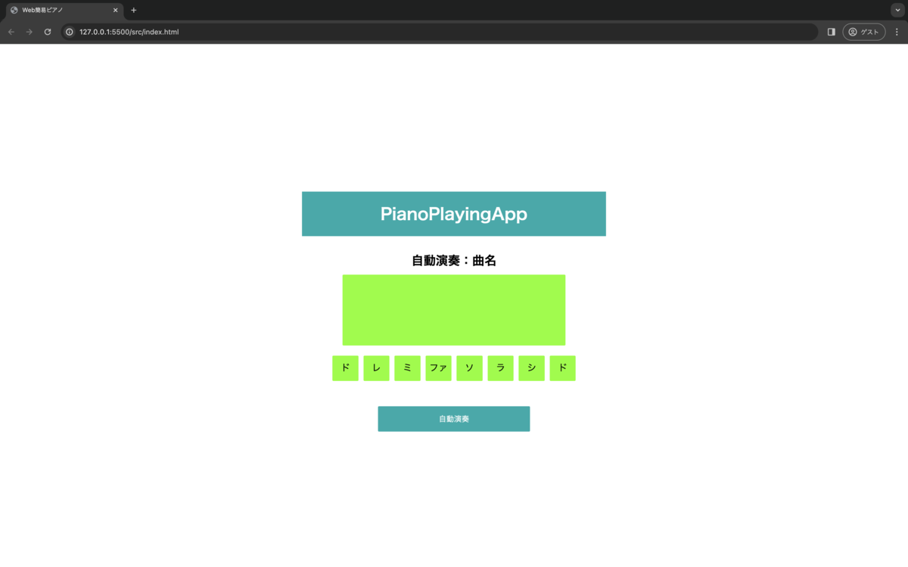

# ポートフォリオ

## 概要
Javascriptで実装したweb簡易アプリです。   
アプリ名：PianoPlayingApp



## 制作経緯
本アプリはJavascriptの復習のために作成しました。

## 要件&仕様
本アプリは下記の

* 各鍵盤に応じて音階が表示されて音が鳴る
* 自動演奏ボタンで「チューリップ」と「きらきら星」のどちらかがランダムで自動演奏される
* 演奏中止ボタンで演奏が中止される

を要件とする簡易なアプリです。

## システム構成
【技術スタック】
* HTML, CSS
* Javascript
* Web Audio API

【ディレクトリ構成】
```
piano-playing-app（ルートディレクトリ）
├── src
│   ├── index.html
│   ├── main.js
│   └── style.css
├── .gitignore
└── README.md
```

## 環境構築
Github から PianoPlayingApp をローカル環境に構築する手順です。   
任意の作業フォルダ内で下記を実施してください。

1. GitHubよりプロジェクトをダウンロードする
```
$ git clone https://github.com/eguchi244/piano-playing-app.git
```

## 動作確認
1. srcディレクトリ内の index.html をダブルクリックする 
ブラウザに PianoPlayingApp が表示されます。
2. 「ドレミファソラシド」の鍵盤をクリックする  
各鍵盤に応じて音階が表示されて音が鳴ります。
3. 自動演奏ボタンをクリックする
「チューリップ」と「きらきら星」のどちらかがランダムで自動演奏されます。
